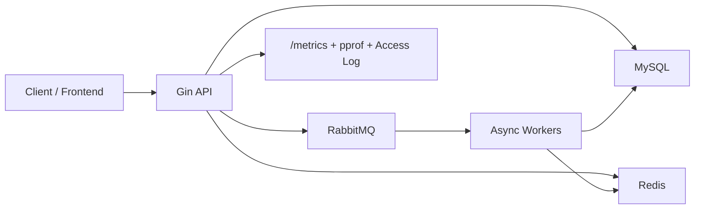

# Feed System Video Go

一个基于 Go 的短视频 Feed 系统，包含账号、视频、点赞、评论、关注与信息流能力，并补了缓存、RabbitMQ 异步写、Prometheus 指标、pprof 和 `wrk` 压测脚本，适合作为后端工程项目展示。

## Features

- 账号：注册、登录、JWT 鉴权、改名、改密
- 视频：发布、详情、作者视频列表
- 互动：点赞、取消点赞、评论发布、评论删除
- 社交：关注、取关、粉丝 / 关注列表
- Feed：`/feed/listLatest`、`/feed/listByPopularity`、`/feed/listByFollowing`
- 可观测性：`/metrics`、pprof、请求访问日志
- 压测：视频详情与 Feed 列表的 `wrk` 脚本

## Tech Stack

- Backend: Go, Gin, GORM
- Storage: MySQL
- Cache: Redis, Local Cache
- MQ: RabbitMQ
- Frontend: Vue 3, Pinia, Vite
- Observability: Prometheus, pprof
- Deploy: Docker Compose

## Highlights

- 给 API 接入了 Prometheus 指标、请求耗时直方图、in-flight 请求统计和访问日志，方便压测取证
- 给 `/video/getDetail` 和 `/feed/listLatest` 补了 Linux / Windows 压测脚本，可直接对比缓存与 MySQL 回源差异
- 评论异步写链路引入 `client_token`，并用 Redis 维护 pending / canceled 状态，解决“先发布再立刻删除”的竞态
- 关注链路改成 Outbox 模式，降低“主库成功、下游分发失败”带来的一致性问题
- 点赞链路补了幂等键和异步失败兜底逻辑
- Feed 读取路径做了批量化和缓存优化，能更稳定拉开不同读路径的性能差异

## Architecture



## Quick Start

### Docker Compose

```bash
docker compose up -d --build
```

默认地址：

- Frontend: `http://127.0.0.1:5173`
- API: `http://127.0.0.1:8080`
- Metrics: `http://127.0.0.1:8080/metrics`
- RabbitMQ Console: `http://127.0.0.1:15672`

### Local Run

先启动依赖：

```bash
docker compose up -d mysql redis rabbitmq
```

启动 API：

```bash
cd backend
go mod download
go run ./cmd
```

启动 Worker：

```bash
cd backend
go run ./cmd/worker
```

配置文件：

- [backend/configs/config.yaml](backend/configs/config.yaml)
- [backend/configs/config.docker.yaml](backend/configs/config.docker.yaml)

## Pressure Test

### Video Detail

Linux:

```bash
HOST=http://127.0.0.1:8080 bash scripts/perf/prepare_perf_data.sh
VIDEO_ID=1 HOST=http://127.0.0.1:8080 bash scripts/perf/run_video_detail_perf.sh
```

Windows PowerShell:

```powershell
$env:HOST = "http://127.0.0.1:8080"
.\scripts\perf\prepare_perf_data.ps1

$env:HOST = "http://127.0.0.1:8080"
$env:VIDEO_ID = "<your_video_id>"
.\scripts\perf\run_video_detail_perf.ps1
```

### Feed List

```bash
HOST=http://127.0.0.1:8080 VIDEO_COUNT=30 bash scripts/perf/prepare_feed_perf_data.sh
HOST=http://127.0.0.1:8080 bash scripts/perf/run_feed_list_latest_perf.sh
```

相关文档：

- [docs/linux-perf-guide.md](docs/linux-perf-guide.md)
- [docs/performance-report-template.md](docs/performance-report-template.md)

## Project Structure

```text
.
├─ backend
│  ├─ cmd
│  ├─ configs
│  └─ internal
├─ frontend
├─ scripts
│  └─ perf
├─ docs
└─ docker-compose.yml
```

## License

MIT
